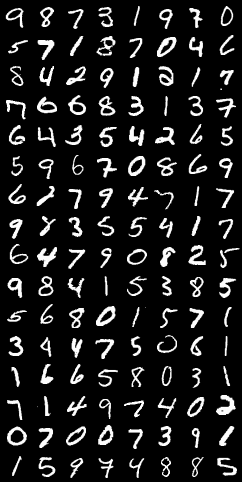
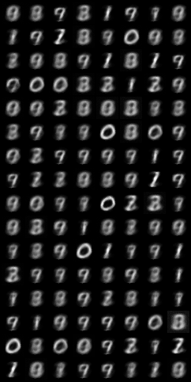
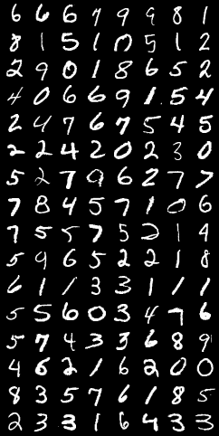
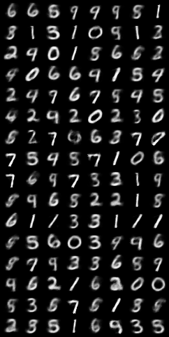
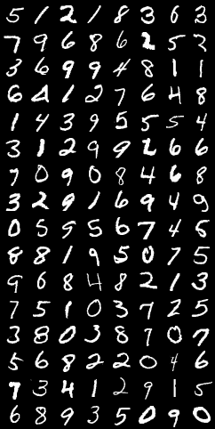
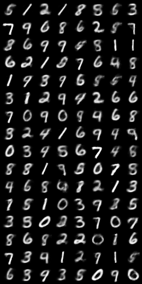
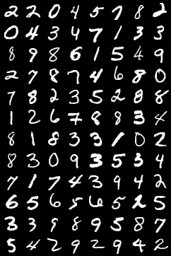
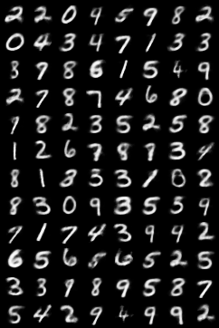
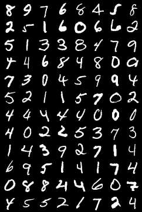
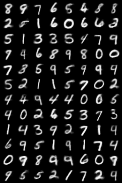

# linear-autoencoder-classifier

This is a linear autoencoder trained on the MNIST dataset using PyTorch. It then uses the trained encoder to build a linear classifier on top.

| Epoch | Original | Reproduced |
|-----------|----------|------------|
| 1 |  |  |
| 11 |  | |
| 21 |  | |
| 41 |  | |
| 71 |  | |

